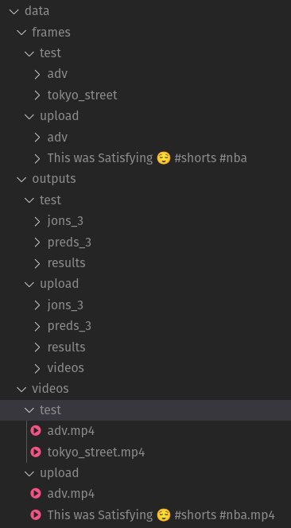

## TransDETR: End-to-end Video Text Spotting with Transformer


[](https://opensource.org/licenses/MIT)


## Introduction
[End-to-end Video Text Spotting with Transformer](https://arxiv.org/abs/2203.10539) | [Youtube Demo](https://www.youtube.com/watch?v=MOYJGqkyWDA)

Video text spotting(VTS) is the task that requires simultaneously detecting, tracking and recognizing text instances
in video. Recent methods typically develop sophisticated pipelines based on Intersection over Union (IoU)
or appearance similarity in adjacent frames to tackle this task. In this paper, rooted in Transformer sequence modeling,
we propose a novel video text **D**Etection, **T**racking, and **R**ecognition framework (TransDETR), which views the VTS task as a direct long-sequence temporal modeling problem.

Link to our new benchmark [BOVText: A Large-Scale, Bilingual Open World Dataset for Video Text Spotting](https://github.com/weijiawu/BOVText-Benchmark)

## Demo
  

## Data structure



## Installation
The codebases are built on top of [Deformable DETR](https://github.com/fundamentalvision/Deformable-DETR) and [MOTR](https://github.com/megvii-model/MOTR).

* Python 3.10

    We recommend you to use Venv to create an environment:
    ```bash
    python3.10 -m venv env
    ```
    Then, activate the environment:
    ```bash
    source env/bin/activate
    ```
  
* Install packages in requirements
    ```bash
    pip install -r requirements.txt
    ```

* Build MultiScaleDeformableAttention
    ```bash
    cd ./models/ops
    sh ./make.sh
    ```

* Install mmcv by downloading https://download.openmmlab.com/mmcv/dist/cu118/torch2.0/index.html (Source: https://mmcv.readthedocs.io/en/latest/get_started/installation.html)

    ```bash
    pip install installation/mmcv-2.0.0-cp310-cp310-manylinux1_x86_64.whl
    ```


#### Streamlit 

```bash
CUDA_VISIBLE_DEVICES=2 streamlit run app.py --server.port 9112 --browser.gatherUsageStats False --server.fileWatcherType none
```


## License

TransDETR is released under MIT License.


## Citing

If you use TransDETR in your research or wish to refer to the baseline results published here, please use the following BibTeX entries:

```
@article{wu2022transdetr,
  title={End-to-End Video Text Spotting with Transformer},
  author={Weijia Wu, Chunhua Shen, Yuanqiang Cai, Debing Zhang, Ying Fu, Ping Luo, Hong Zhou},
  journal={arxiv},
  year={2022}
}
```
